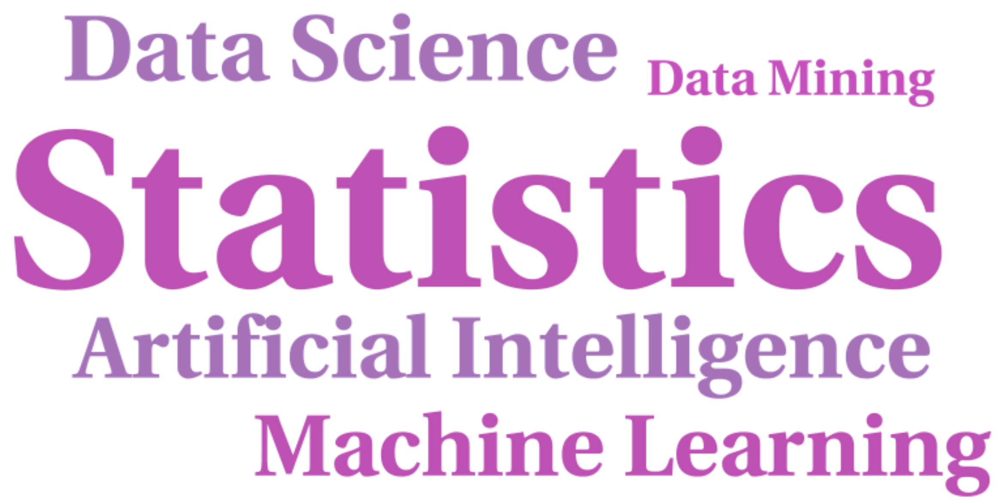
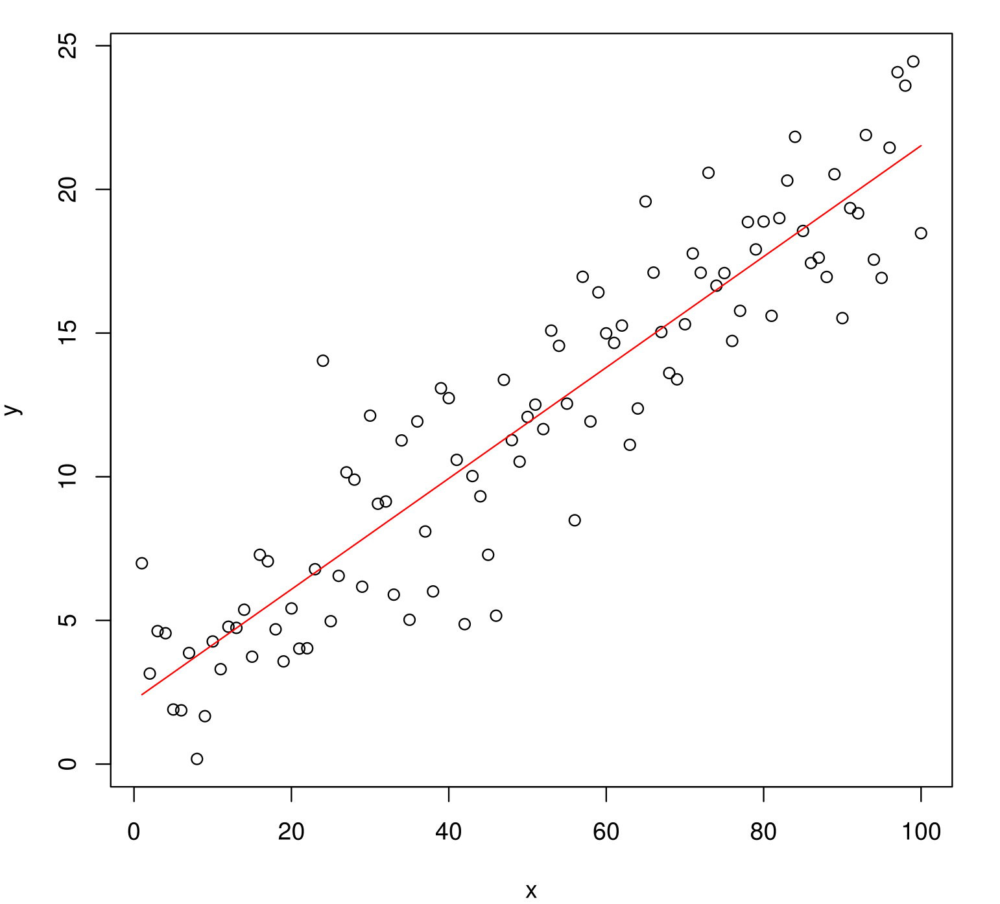
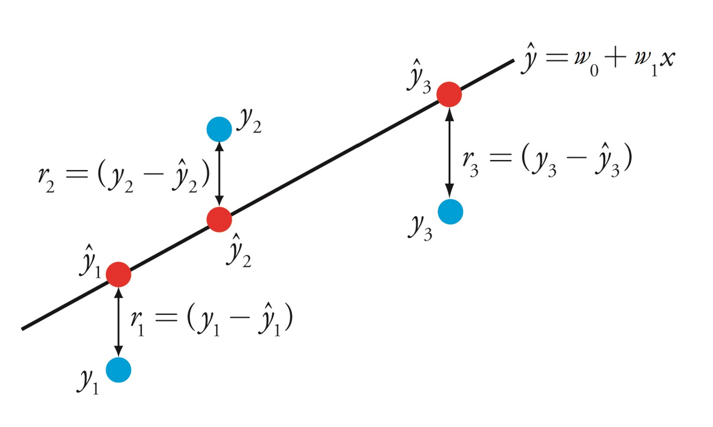
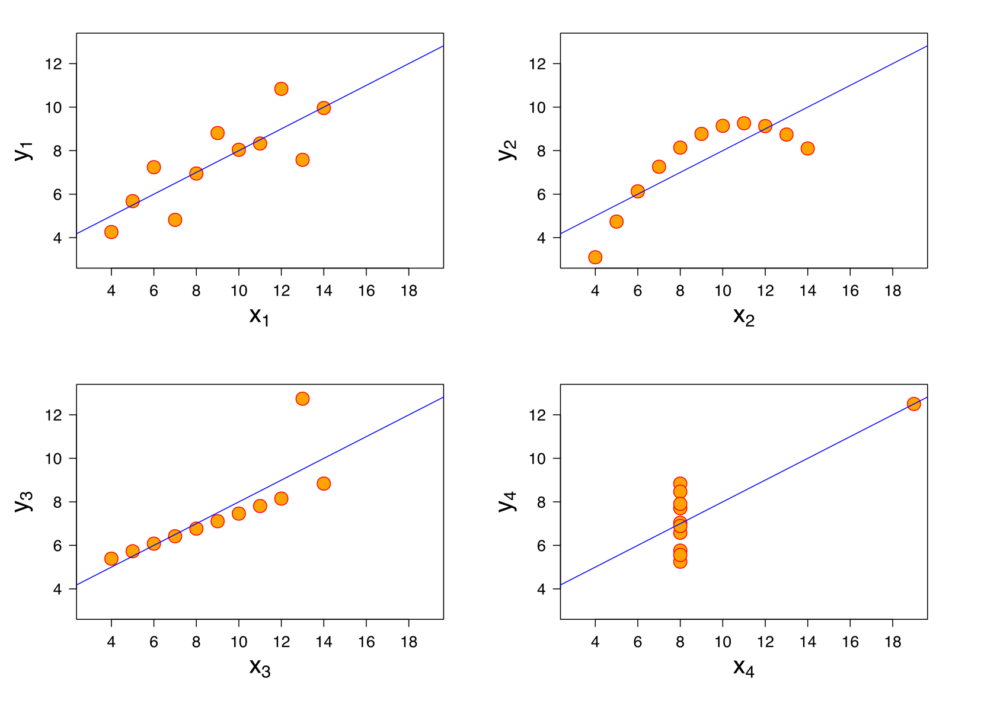
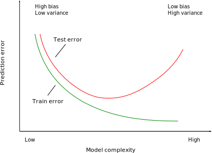
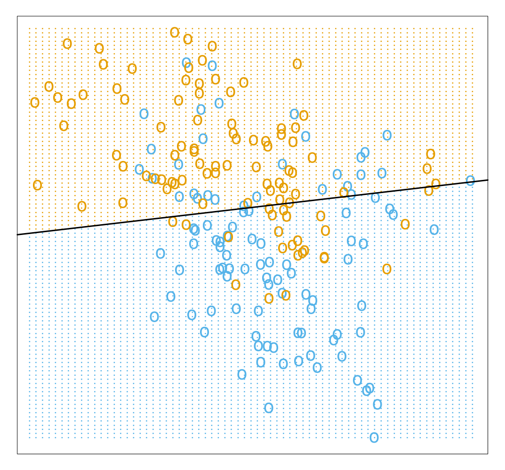
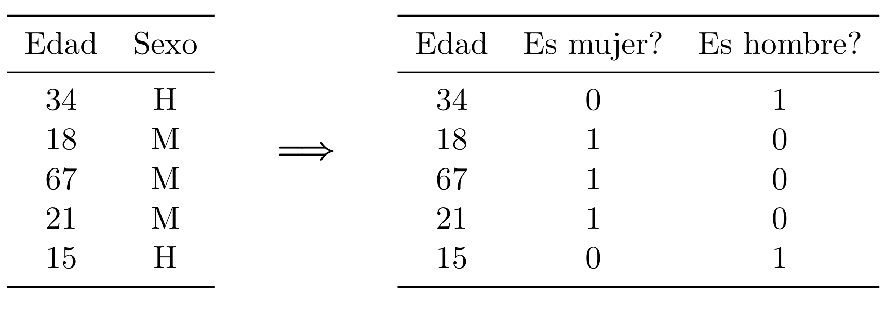
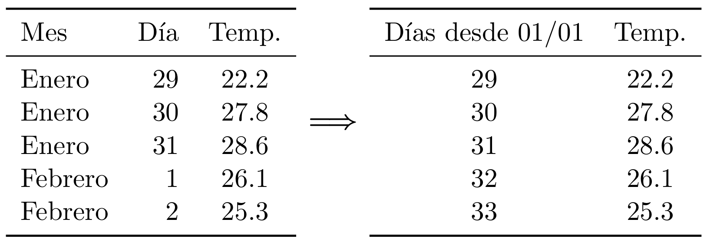

# ¿Qué es el Aprendizaje Automático? 

De la Wikipedia:

*Machine learning is a subfield of **computer science** that evolved from the study of **pattern recognition** and computational learning theory in artificial intelligence. In 1959, Arthur Samuel defined machinelearning as a “Field of study that gives computers the ability to learn without being **explicitly programmed**”. Machine learning explores the study and construction of algorithms that can learn from and make predictions on **data**.*

---
class: center, middle


Fuente: [xkcd #1838](https://xkcd.com/1838/)

??? 

Aprendizaje automático en la práctica tiene mucho de ingeniería y no tanto de "ciencia"

Mucho prueba y error

La calidad del software ha aumentado mucho en los últimos años, casi cualquiera puede ajustar estos modelos sin conocimientos teóricos profundos

---
class: center, middle



???

* Statistics Más antigua (aprox. 1749), el resto de disciplinas utilizan algunas de sus técnicas: estadística descriptiva, análisis de regresión, inferencia.
* Artificial Intelligence Más moderna, 1940. Algunos problemas que intenta resolver: procesamiento lenguaje natural, planificación, visión por computador, robótica.
* Machine Learning Rama de la IA, 1946. Se utiliza para resolver algunos de los problemas que tiene la IA.
* Pattern Recognition En general se usa como sinónimo de Machine Learning.
* Data Mining Técnicas de modelado estad´ıstico y machine learning aplicadas a un dominio en concreto.
* Data Science Término más moderno, mezcla de todo lo
anterior.

---
class: center

# Data science


Fuente: [R for Data Science](http://r4ds.had.co.nz/)

???

Machine learning == parte de modelado
Data Science == todos los pasos

---

## Estadística vs aprendizaje automático

| Estadística                      | Aprendizaje automático           |
|----------------------------------|----------------------------------|
| Énfasis en inferencia            | Énfasis en predicción            |
| Cuantificar incertidumbre        | Optimizar                        |
| Entender el principio subyacente | Predecir con precisión           |
| Matemáticas                      | Computación                      |
| Mayor intervención humana        | Mayor intervención de la máquina |

---

## Casos de éxito

  * Coches autónomos
  
  * Análisis de imágenes médicas
  
  * Procesamiento de lenguaje natural
  
  * AlphaGo y juegos Atari
  
  * Generación de imágenes
  
  * Sistemas de recomendación


---

class: middle, center

## Herramientas


???

Un poco antigua, en la del 2018 Python supera a R pero ambos son muy populares

---

# Tipos de aprendizaje

Existen diversos tipos de tareas, dependiendo de la información disponible:

- **supervisado**: tenemos acceso a pares de ejemplos entrada-salida

- **no supervisado**: no tenemos acceso a las salidas

- otros (limitando de alguna forma el acceso a las salidas):
  
  * *activo*: el algoritmo puede acceder a la salida para nuevos datos de entrada
  
  * *semi-supervisado*: solo se tienen salidas para algunos datos
  
  * *refuerzo*: no se tiene el valor de la salida, pero si una indicación de lo lejos o cerca que se encuentra

---

# Referencias

   1. Jerome H. Friedman. [Data Mining and Statistics: What's the Connection? (1998)](http://statweb.stanford.edu/~jhf/ftp/dm-stat.pdf)
   
   2. Leo Breiman. [Statistical Modeling: The Two Cultures (2001)](http://projecteuclid.org/download/pdf_1/euclid.ss/1009213726)
   
   3. Cross Validated. [What is the difference between data mining, statistics, machine learning and AI (2010).](http://stats.stackexchange.com/questions/5026/what-is-the-difference-between-data-mining-statistics-machine-learning-and-ai)
   
   4. Sakthi Dasan Sekar. [What is the difference between Artificial Intelligence, Machine Learning, Statistics, and Data Mining (2014)](http://shakthydoss.com/what-is-the-difference-between-artificial-intelligence-machine-learning-statistics-and-data-mining/)
   
   5. Cross Validated. [What exactly is Big Data? (2015)](http://stats.stackexchange.com/questions/173060/what-exactly-is-big-data)
   
   6. David Donoho. [50 years of Data Science (2015)](http://pages.cs.wisc.edu/~anhai/courses/784-fall15/50YearsDataScience.pdf)


???

Dos culturas:

Una asume que los datos han sido generados por un modelo estocástico específico. 
Otra usa modelos algorítmicos y asume que el mecanismo de generación de los datos es desconocido

---

class: middle, center, inverse

# Aprendizaje supervisado

---

* Tenemos disponibles datos con múltiples observaciones:
   
   * ejemplos (*examples*)
   * muestras (*samples*)
   * ...

--

* Varias variables por observación:
  
  * predictores
  * atributos (*atributes*)
  * características (*features*)
  * covariables (*covariates*)
  * variables independientes
  * variables explicativas
  * ...

--

* Una de ellas es de especial interés: 
  
  * variable respuesta
  * variable dependiente
  * objetivo (*target*)
  * salida (*output*)
  * etiqueta (*label*)
  * ...
  
---

## Objetivos

  1. Predecir el valor de la variable respuesta para nuevas observaciones
   
  2. Obtener información sobre la relación entre las variables independientes y la salida


???

Información sobre la relación, por ej: qué variables son más relevantes

---

## Tipos de problemas

  1. **Regresión**, si la variable respuesta es continua
  
  2. **Clasificación**, si la variable respuesta es discreta
  
  3. Otros: por ejemplo,
    
    * salida continua pero valores enteros
    
    * salida discreta pero los valores tienen un orden
  
---

## Regresión lineal

Uno de los modelos más sencillos de regresión

.center[

]


---

## Regresión lineal: formulación 

* Si tenemos $d$ variables $x_1$, $x_2$, ..., $x_d$

* La regresión lineal asume que la variable respuesta $y$ depende linealmente de las $x$ $$y = w_0 + w_1x_2 + w_2x_2 + \dots + w_dx_d$$

* $w_0$ es el término de bias

* El objetivo es estimar los pesos $w$

* Método más habitual: mínimos cuadrados

* Modelo predictivo: podemos calcular el valor de $y$ para nuevos valores de $x$

---

## Hipótesis de la regresión lineal

Posibles problemas del modelo:

 * Teóricos: 
   
   1. asumimos que $y$ depende linealmente de $x$
   
   2. asumimos que el modelo está especificado correctamente (no faltan variables)
   
 * Numéricos:
   
   1. hay menos variables que observaciones
   
   2. no hay dos variables con correlación perfecta


???

En los problemas numéricos, en ambos casos hace que la matriz no tenga rango completo y por tanto no podemos calcular la inversa (de forma exacta!!)

---

## Mínimos cuadrads



---

## Calidad del ajuste

La pregunta es, ¿cómo de bien se ajusta la recta a los datos?

.center[

]

---

## Minimización del riesgo empírico

* Cuantificar la capacidad predictiva del modelo

* Dadas unas variables $x$, buscamos una función $f(x)$ que se parezca lo máximo posible a $y$

* Definimos una función de pérdida $L(f(x), y)$,

   1. si $f(x)$ e $y$ se parecen, $L$ toma valores pequeños

   2. si $f(x)$ e $y$ son muy distintos, la función devuelve valores grandes
   
* Problema de aprendizaje: encontrar la función $f$ que minimiza la pérdida media para todas las obervaciones $$\hat{f} = \frac{1}{n}\sum_{i=1}^{n}{L(f(x_i), y_i)}$$

---

## Selección de modelos

* Para $L(f(x), y) = (f(x) - y)^2$ obtenemos mínimos cuadrados

* Para medir la calidad del modelo, podemos calcular la pérdida media en el conjunto de entrenamiento

* **Problema**: este error se puede disminuir de forma casi arbitraria aumentando la complejidad de la clase de funciones

* **Ejemplo**: en el caso de la regresión lineal, podemos añadir nuevas variables que sean expansiones polinómicas de las ya existentes

* Queremos minimizar el **error de generalización**, es decir, el error en nuevas observaciones no usadas para entrenar el modelo


???

* El error de test es una buena aproximación del error de generalización

* Estamos asumiendo que ambos provienen de la misma distribución

* Por tanto, la partición tiene que ser aleatoria

---

## Ejemplo

```{r echo=FALSE, fig.align='center'}
set.seed(1)
n <- 10
x <- seq(0, 1, length.out = n)
y <- 1.5*x - x^2 + rnorm(n, 0, 0.05)
data <- data.frame(x=x, y=y)

x_new <- seq(0, 1, length.out=500)
newdata <- data.frame(x=x_new)

fit1 <- lm(y ~ x + I(x^2), data=data)
fit2 <- lm(y ~ x + I(x^2) + I(x^3) + I(x^4) + I(x^5) 
                 + I(x^6) + I(x^7) + I(x^8) + I(x^9), 
           data=data)
fit3 <- lm(y ~ x, data=data)

y_pred1 <- predict(fit1, newdata=newdata)
y_pred2 <- predict(fit2, newdata=newdata)

ntest <- 1
xtest <- runif(ntest)
ytest <- 1.5*xtest - xtest^2 + rnorm(ntest, 0, 0.05)

plot(data)
lines(x_new, y_pred1, col="blue")
lines(x_new, y_pred2, col="red")
abline(fit3, col="purple")
points(xtest, ytest, col="darkgreen")
legend("bottomright", 
       c(expression(w[0] + w[1]*x), 
         expression(w[0] + w[1]*x + w[2]*x^2),
         expression(w[0] + w[1]*x + w[2]*x^2 + ldots + w[9]*x^9)), 
       lty=1, lwd=1.5, col=c("purple", "blue", "red"), inset=0.04)
```

---

## Conjuntos de entrenamiento y test

* En la práctica, lo primero que hacemos cuando cargamos unos datos es dividirlos aleatoriamente en dos subconjuntos, entrenamiento y test

* El subconjunto de test nos lo guardamos y no se utiliza nunca en la fase de aprendizaje del modelo

* Una vez ajustado el modelo, se comprueba su
rendimiento en el conjunto de test.

* Este error es una buena estimación no sesgada de como se va a comportar nuestro modelo con nuevos datos.

---

## Equilibrio sesgo-varianza

* El error esperado de un estimador $\hat{f}(X)$ en el punto $x$ (usando pérdida cuadrática) es $$\text{EPE} = \mathbb{E}[(Y - \hat{f}(x))^2]$$

* Podemos descomponerlo en: $$\text{EPE} = \underbrace{\Bigl(\mathbb{E}[\hat{f}(x)] - f(x) \Bigr)^2}_{\text{Sesgo}^2} + \underbrace{E\Bigl[\hat{f}(x) - \mathbb{E}[\hat{f}(x)] \Bigr]^2}_{\text{Varianza}} + \underbrace{\vphantom{\Bigl(}\sigma^2}_{\text{Ruido}}$$

---

class: center, middle


---

## Sobreajuste

* Los términos de sesgo y varianza son opuestos: si disminuimos uno aumenta el otro y viceversa

* El término de ruido es inherente a los datos

* Si el modelo es muy simple, el estimador está sesgado y no se ajusta bien a los datos (infraajuste)

* Si el modelo es demasiado complejo, es muy sensible a pequeñas variaciones en los datos

* Además, el error de test será mucho más alto que el error de entrenamiento (**sobreajuste**)

* **Solución**: encontrar un equilibrio que minimice el error en el conjunto de test

---

class: middle, center




---

## Métricas de regresión

* Valor real muestra $i$, $y_i$

* Estimación del modelo, $\hat{y}_i$

* Error cuadrático medio o *mean squared error* (MSE) $$\text{MSE} = \frac{1}{n}\sum_{i=1}^{n}{(y_i - \hat{y}_i)^2}$$

* Error absoluto medio o *mean absolute error* (MAE) $$\text{MAE} = \frac{1}{n}\sum_{i=1}^{n}{|y_i - \hat{y}_i|}$$

---

## Problemas de clasificación

.center[


Ejemplo de clasificación en 2 dimensiones [Elements of Statistical Learning]
]

---

## Vecinos próximos

* Modelo sencillo que usa las observaciones cercanas a $x$ para realizar la predicción: $$f(x) = \frac{1}{k} \sum_{x_i \in N_k(x)} y_i$$ donde $N_k(x)$ son las $k$ observaciones más cercanas

* Necesaria una métrica (por ej. distancia euclidea)

* Se puede usar tanto para problemas de clasificación como regresión

* Muy sensible al valor de $k$

---

class: center, middle


---

```{r echo=FALSE, message=FALSE, warning=FALSE, fig.align='center'}
library(wSVM)
require(class)
plot_knn <- function(k) {
  x <- mixture.example$x
  g <- mixture.example$y
  xnew <- mixture.example$xnew
  mod15 <- knn(x, xnew, g, k=k, prob=TRUE)
  prob <- attr(mod15, "prob")
  prob <- ifelse(mod15=="1", prob, 1-prob)
  px1 <- mixture.example$px1
  px2 <- mixture.example$px2
  prob15 <- matrix(prob, length(px1), length(px2))
  par(mar=rep(2,4))
  contour(px1, px2, prob15, levels=0.5, labels="", xlab="", ylab="", main=
          paste("Vecinos próximos, k=", k, sep=""), axes=FALSE)
  points(x, col=ifelse(g==1, "coral", "cornflowerblue"))
  gd <- expand.grid(x=px1, y=px2)
  points(gd, pch=".", cex=1.2, col=ifelse(prob15>0.5, "coral", "cornflowerblue"))
  box()
}

plot_knn(15)
```

---

## Métricas de clasificación 

Los principales errores de clasificación se pueden calcular a
partir de la **matriz de confusión**:

.pull-left[

]

.pull-right[
Accuracy: $\frac{\text{TP} + \text{TN}}{\text{P} + \text{N}}$

Sensitivity, recall, TPR: $\frac{\text{TP}}{\text{TP} + \text{FN}}$

Specificity, TNR: $\frac{\text{TN}}{\text{TN} + \text{FP}}$

Precision, PPV: $\frac{\text{TP}}{\text{TP} + \text{FP}}$

F1 score: $2\times \frac{\text{PPV} \times \text{TPR}}{\text{PPV} + \text{TPR}}$
]

---

## Regresión lineal vs vecinos próximos

* La frontera de decisión de la regresión lineal es suave: tiene poca varianza pero potencialmente mucho sesgo

* $k$-vecinos próximos no asume ninguna estructura en los datos: 

    * la frontera de decisión depende localmente solo de los $k$ puntos más cercanos
    * tiene poco sesgo pero mucha varianza, ya que es muy inestable

* Elegir un modelo u otro depende de los datos del problema


---

## Vecinos próximos: dependencia de $k$


```{r echo=FALSE, message=FALSE, warning=FALSE, fig.align='center'}
plot_knn(1)
```

---

```{r echo=FALSE, message=FALSE, warning=FALSE, fig.align='center'}
plot_knn(5)
```

---

```{r echo=FALSE, message=FALSE, warning=FALSE, fig.align='center'}
plot_knn(50)
```

---

## Selección de hiper-parámetros

* $k$ es un **hiper-parámetro** que controla la complejidad del modelo

* Podemos realizar un argumento similar a la comparación con la regresión lineal:

   * Para $k$ grande, la frontera es más suave pero tiene (potencialmente) mayor sesgo
   * Para $k$ pequeño la frontera es muy inestable (mayor varianza), pero menos sesgo

* Nota: usar el error de entrenamiento para elegir el valor de $k$ es mala idea, para $k=1$ tenemos error 0!!

* Los distintos valores de $k$ se pueden comparar usando el conjunto de test

---

## Conjunto de validación

 * Elegir $k$ como el valor que minimiza error de test $\rightarrow$ error de test ya **no** es una buena estimación del rendimiento del modelo en nuevos datos
 
 * Lo mismo ocurre si elegimos la clase de funciones (modelo) usando el error de test
 
 * **Solución**: crear un tercer conjunto, conjunto de validación, para seleccionar hiper-parámetros y comparar modelos
 
 * Finalmente, reportar el error de test como estimación del poder de generalización del modelo

---

## Validación cruzada

* Se divide el conjunto de entrenamiento en $K$ particiones

* Usar $K-1$ particiones como entrenamiento y la otra como test para ajustar $K$ modelos

* $\hat{f}^{-k}(x)$ es el modelo entrenado con todas las particiones menos la $k$

* Calcular el error de validación cruzada: $$\text{CV}(\hat{f}) = \frac{1}{n}\sum_{i=1}^n{L(y_i, \hat{f}^{-\kappa(i)}(x_i))}$$
donde $\kappa: \{1, \dots, n\} \rightarrow \{1, \dots, K\}$ es una función que indica a que partición pertenece cada observación $i$ 

* Cuando $K = n$ se conoce como validación cruzada *leave-one-out*

???

Tipicos valores para $K$ son 5 o 10
LOOCV el estimador del error de generalizacion es aprox. no sesgado pero puede tener mucha varianza. Tambien es computacionalmente muy costoso

---

class: middle, center


Wikipedia. [Cross-validation](https://en.wikipedia.org/wiki/Cross-validation_(statistics))

---

## Regularización

* A menudo se puede reducir la varianza de un estimador a cambio de introducir un pequeño sesgo

* Este término también puede inducir propiedades en la solución, por ej. *sparsity*

* Para ello limitamos la complejidad del modelo añadiendo a la función de pérdida un término de **regularización** $$\min_f\; \{L(y, f(x)) + \lambda J(f)\}$$

* Muchos modelos en aprendizaje automático encajan en este paradigma

---

## Ejemplo

* El estimador de mínimos cuadrados es el mejor estimador no sesgado (mejor = menos varianza)

* Un término de regularización muy habitual es la norma $l_2$: $$||w||^2_2 = w^T w$$

* Junto con la función de pérdida de la regresión lineal, el modelo se conoce como regresión ridge: $$\min_w\; \{(y - \mathbf{X}w)^T (y - \mathbf{X}w) + \lambda w^Tw\}$$


???


BLUE = Best linear unbiased estimator (teorema de Gauss)

Ahora siempre es invertible para $\lambda > 0$

Funcion en R: lm.ridge(), paquete MASS


---

class: middle, center, inverse

# Aprendizaje supervisado en la práctica

---

## Primeros pasos

* Los datos a analizar a menudo provienen de fuentes
variadas (redes sociales, sensores, encuestas, ...) y están
almacenados en diferentes soportes (ficheros de texto, base
de datos, ficheros binarios, streams...)

* Lo primero es identificar el problema qué queremos resolver
y cuales son las variables que tenemos disponibles y pueden
aportar información

* Ante la duda, no descartar variables/información ni
observaciones antes de tiempo

* Lo segundo es combinar todas esa información y
transformarla en una mezcla de variables numéricas
(valores continuos) y categóricas (valores discretos)

* El objetivo final del preproceso es organizar esos datos en
un formato tabular (filas y columnas)


---

## Distintos tipos de información

* En ocasiones no es trivial transformar ciertos tipos de información en variables numéricas y/o categóricas

* Para estos casos a menudo es necesario un preproceso extra, muy dependiente del problema a resolver y específico del dominio

* Ejemplos:

  1. Texto (tweets, páginas web, documentos): word2vec, bag-of-words, modelos n-gram
 
  2. Imágenes: valores RGB de los píxeles, intensidad de gris

  3. Audio: transformada de Fourier, coeficientes MFCC

  4. Video: secuencia de frames
  
  5. Series temporales: añadir *lags* como variables


---
  
## Valores que faltan

* Es importante distinguir cuando una variable tiene valor 0 de "no conocido"

* Si es posible, nos gustaría saber también el mecanismo que origina el valor que falta:
  
  1. MCAR (*Missing Completely At Random*): el motivo por el que falta un valor no está relacionado con otras variables 
  
  2. MAR (*Missing At Random*): el motivo está relacionado con otras variables 
  
  3. NMAR (*Not Missing At Random*): no sabemos el motivo por el que falta

* Estos valores pueden venir representados por múltiples caracteres (“*”, “-”, campo vacio, etc.)

* Hay que codificarlos de manera especial para tenerlos en cuenta en los análisis (en R `NA`)


**Ejemplo**: en datos que provienen de un reconocimiento médico varios pacientes no tienen ningún valor en el campo de “Fármacos”. ¿No toman ninguna medicación o el médico no ha registrado la respuesa?

???

MCAR: se pueden ignorar o completar con los valores de esa variable
MAR: se pueden completar con los valores de esa variable teniendo en cuenta los valores de las variables con las que asumimos que está relacionado
NMAR: no podemos hacer gran cosa

---

## Completar valores que faltan

1. Ignorar observaciones donde falte alguna variable
  
2. Completar observaciones con:

  * media o mediana, datos continuos
  
  * moda, datos categóricos

  usando:
    
  * todas las observaciones de esa variable
  
  * observaciones pero agrupadas por otras variables

3. Modelos predictivos
  
  * Paquete `mice` en R

  * KNN: usar solo observaciones cercanas


Otras [librerías](https://medium.com/coinmonks/dealing-with-missing-data-using-r-3ae428da2d17)

???

1. se pierden datos, solo es completamente seguro para MCAR

2. para datos MAR, dificil saber de antemano por que variables hay que agrupar

3. KNN: muy costoso si hay muchas observaciones, elegir valor de k es critico

---

## Valores extremos

* Distinguir si un valor es erróneo o válido pero extremo es muy complicado y dependiente del dominio

* Existen diversas reglas para identificarlos (paquete `outliers`)

* Pueden perjudicar a ciertos algoritmos de aprendizaje, mientras que otros son robustos frente a este tipo de datos

* Comprobar siempre que no hay valores imposibles

Ejemplo: en datos provenientes de un reconocimiento
médico, aparece un paciente con un IMC de 50

---

## Tratamiento valores extremos

1. Eliminar la observación

2. Asignar como nuevo valor el límite inferior/superior de los valores normales

3. Asignar al valor extremo `NA` e imputar su nuevo valor usando las técnicas para valores que faltan

???

Ejemplo, distancia de Cooke?

---

## Normalización

* Las variables numéricas suelen tener rangos muy diversos

* **Ejemplo**: salario (10,000 – 100,000 EUR) y edad (0–100)

* Algunos modelos interpretan esta diferencia de escalas como que unas variables son más importantes que otras o las observaciones están más próximas

* En ocasiones normalizar las variables también puede ayudar a que el algoritmo de optimización converja más rápido

* Cuidado al analizar los resultados, ya que están en los nuevos rangos

---

## Métodos

* Media 0 varianza 1 (estandarizar): $$z = \frac{x - \text{mean}(x)}{\text{std}(x)}$$
  
* Escalar a un intervalo, por ej. $[−1,\, 1]$: $$z = \frac{x - \min(x)}{\max(x) - \min(x)}$$

* Estandarización robusta: $$z = \frac{x - \text{median}(x)}{\text{IQR(x)}}$$

* Otros

???

Se puede escalar a otro rango arbitrario

Escalar a [-1, 1] preserva los 0, pero es sensible a outliers

---

## Variables categóricas

* Muy comunes en todo tipo de fuentes de datos

* Muy pocos algoritmos de aprendizaje son capaces de tratarlas directamente

* Por tanto, tenemos que convertirlas en numéricas

* La transformación donde se asigna a cada uno de sus valores un número entero no suele ser buena idea, ya que crea una relación artificial de orden y falsea las distancias

* Estándar: utilizar una codificación *dummy* (*one-hot encoding*)

---

## Codificación *dummy*



* Finalmente, podemos eliminar una de las dos nuevas variables puesto que tienen correlación 1

* En general, para una variable categórica con $p$ valores añadimos $p−1$ variables nuevas

???

En R, la funcion `dummy_cols()` de la libreria `fastDummies`

---

## Otras codificaciones


* Codificación **ordinal**: variables ordinales, por ej. puntuación: {baja, media, alta} $\Rightarrow$ {1,2,3} (cuidado con las distancias!)

* Codificación **binaria**: variables ordinales con alta dimensión, transformar la codificación a código binario

* **Hashing**: codificar los valores usando una función de *hash*, que transforma cualquier valor a un número fijo de bits (columnas)


* **Leave One Out**: el valor $C$ de la variable categórica para la observación $i$ se codifica como la media de la salida para todas las observaciones con valor $C$ en la variable categórica, excluyendo $i$

* [Codificación de similitud](https://arxiv.org/pdf/1806.00979.pdf)

* ...

---

## Codificaciones específicas del dominio

* Ejemplo si hay relación de orden y no queremos falsear las distancias:


